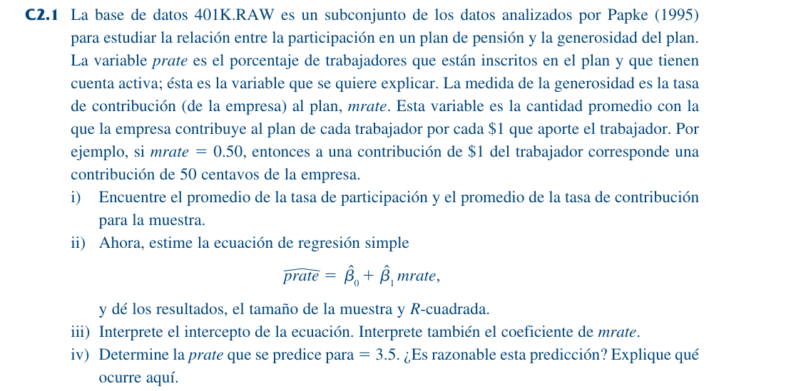
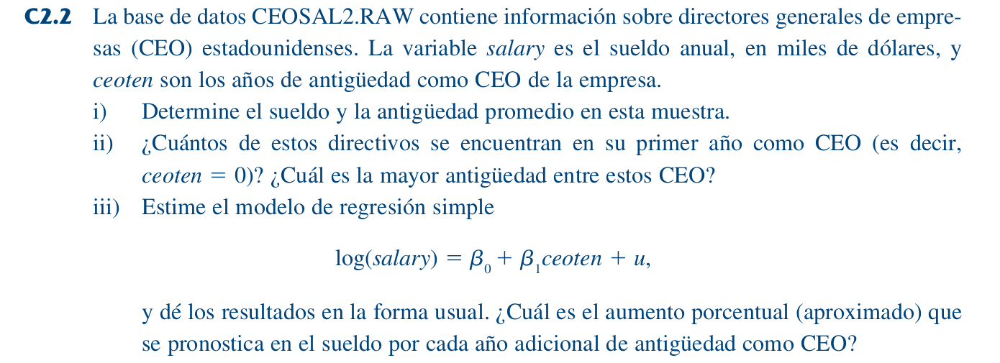
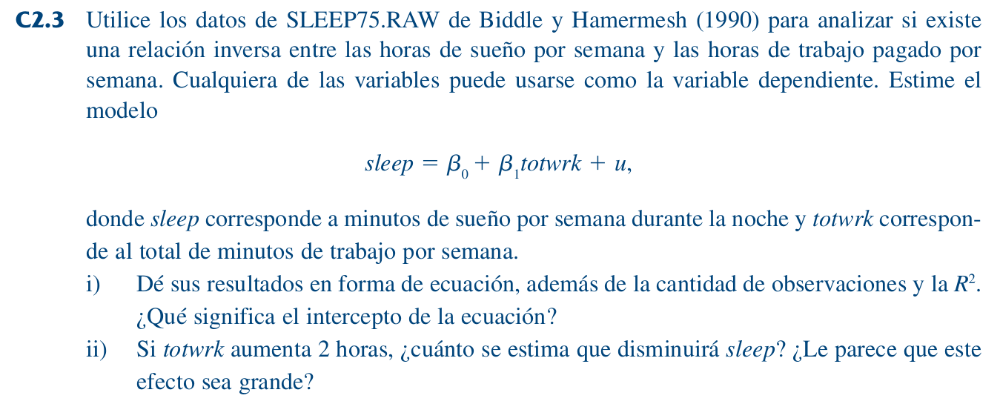
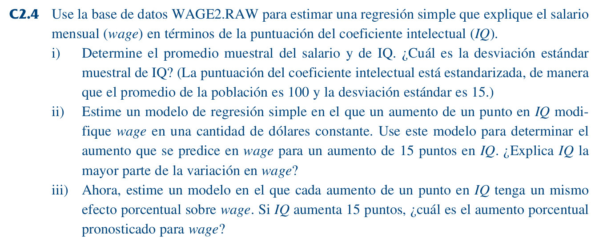
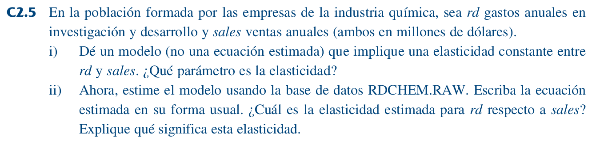
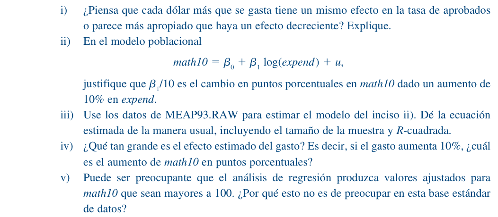
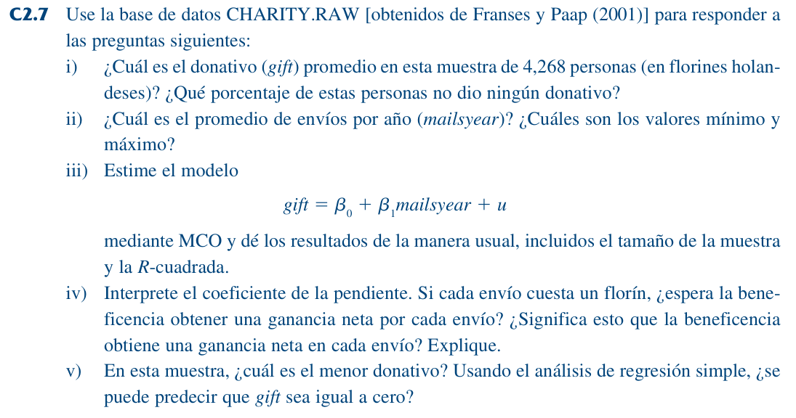

```{r}
library(glue)
library(wooldridge)
```

# Ejercicio 2.1



Cargamos y nombramos los datos $k401k$ obtenidos del paquete "wooldridge":

```{r}
data("k401k", package = "wooldridge")
df1 <- k401k
```

## I. Promedio de las tasas de participación y contribución para la muestra

Con la función $mean$ calculamos los promedios de las variables $prate$ y $mrate$ del dataframe $df1$:

```{r}
participación_media = round(mean(df1$prate), 3)  
contribución_media = round(mean(df1$mrate), 3)  
```

```{r}
glue("La tasa media de participación es: {participación_media}")
glue("La tasa media de contribución es: {contribución_media}")
```

## II. Estimación de la ecuación de regresión simple

Con la función $lm(linear model)$ estimamos la ecuación de la tasa de participación en función de la tasa de contribución:

$$ \widehat{\text{prate}} = \beta_0 + \beta_1 \cdot \text{mrate} $$

```{r}
modelo_1 <- lm(prate ~ mrate, data = df1)
summary(modelo_1)
```
De los resultados de la regresión se entiende que el coeficiente $\beta_1$ es significativo al 0.01% y que el $R^2$ es del 0.075. 

## III. Interpretación del intercepto y del coeficiente de contribución

$$ \widehat{\text{prate}} = 83.0755 + 5.8611 \cdot \text{mrate} $$

* El intercepto $\beta_0 = 83.07$ indica que si la empresa no aporta ningún dólar, se espera que la tasa de participación en el plan sea de 83.07%.  

* El coeficiente de $mrate$, $\beta_1 = 5.86$, indica que por cada dólar adicional que aporte la empresa por cada dólar aportado por el profesional, se espera que la tasa de participación en el plan aumente en promedio 5.86 puntos porcentuales.

## IV. Tasa de participación estimada para una tasa de contribución de 3.5

$$ \widehat{\text{prate}} = 83.0755 + 5.8611 \cdot 3.5 $$

```{r}
beta_0 = 83.075
beta_1 = 5.86
mrate = 3.5

estimado = 83.0755 + 5.86 * 3.5
estimado
```
Esta predicción no es razonable, pues estima que para una contribución de 3.5 dólares por dólar, la tasa de participación será del 103.58%, cuando se entiende que la tasa máxima de participación es del 100%.

# Ejercicio 2.2



Cargamos y nombramos los datos $ceosal2$ obtenidos del paquete "wooldridge":

```{r}
data("ceosal2", package = "wooldridge")
df2 <- ceosal2
```

## I. Sueldo y antigüedad media de la muestra

Con la función $mean$ calculamos los promedios de las variables $salary$ y $ceoten$:

```{r}
salario_medio = round(mean(df2$salary), 3)
tenure_media = round(mean(df2$ceoten), 3)
```

```{r}
glue("El salario medio es: {salario_medio}")
glue("La antigüedad media es: {tenure_media}")
```


## II. Número de CEO's que están en su primer año (ceoten = 0) y antigüedad máxima

Con la función $sum$ contamos las filas (CEO's) para las cuales la variable $ceoten$ es igual a cero:

```{r}
sum(ceosal2$ceoten == 0)
```
Con la función $max$ obtenemos el valor máximo que toma la variable $ceoten$:

```{r}
max(ceosal2$ceoten)
```
## III. Estimación del modelo de regresión simple Log-Nivel

$$ \widehat{\text{log(salary)}} = \beta_0 + \beta_1 \cdot \text{ceoten} $$
Aplicamos logaritmo natural a la variable $salary$:

```{r}
df2$ln_salary = log(df2$salary)
```

Calculamos el modelo con $lm$:

```{r}
modelo_2 = lm(ln_salary ~ ceoten, data = df2)
summary(modelo_2)
```

Modelo estimado:

$$ \text{log(salary)} = 6.505 + 0.009724  \cdot \text{ceotenure}  $$

El coeficiente estimado de $ceoten$ en el modelo log-nivel es 0.0097, lo que indica que por cada año adicional como CEO, el salario aumenta en promedio un 0.97%. Sin embargo, este efecto no es estadísticamente significativo, lo cual sugiere que no hay evidencia suficiente para afirmar que la antigüedad como CEO afecta el salario. Además, el $R^2$ del modelo es muy bajo (1.3%), lo que indica una capacidad explicativa limitada de este modelo.

# Ejercicio 2.3



Cargamos y nombramos los datos $sleep75$  obtenidos del paquete "wooldridge":

```{r}
data("sleep75", package = "wooldridge")
df3 <- sleep75
```

## I. Estimación del modelo Nivel-Nivel

$$  \text{sleep} = \beta_0 + \beta_1 \cdot totwrk + \mu  $$

Calculamos el modelo con $lm$:

```{r}
modelo_3 <- lm(sleep ~ totwrk, data = df3)
summary(modelo_3)
```

La ecuación estiamada a partir de la regresión es:

 $$ \widehat{\text{sleep}} = 3586 - 0.15 \cdot \text{totwrk} $$

* La variable $totwork$ es estadísticamente significativa al 1%; el $R^2$ es 0.1033, indicando que la    variación en el total de horas de trabajo explica el 10.33% de la variación en las horas de sueño.

* Estos resultados sugieren que por cada minuto adicional de trabajo semanal, en promedio se reducen 0.15 minutos de sueño semanal. 

* Además, el intercepto $\beta_0 = 3586$, significa que una persona desempleada, pensionada o que no trabaja, duerme en promedio 3586 minutos por semana durante la noche.

## II. ¿Qué pasa con las horas de sueño cuando se trabajan dos horas semanales más?

Se crean los valores para evaluar el modelo y realizar la diferencia:

```{r}
Beta_0 = 3586
Beta_1 = 0.15
totwrk = 120

estimado = Beta_0 - Beta_1 * totwrk
estimado

diferencia = Beta_0 - estimado
diferencia
```

Si una persona trabaja 2 horas más a la semana, se estima que dormirá 18 minutos menos por semana, es decir, alrededor de 2.6 minutos menos por noche.

En términos relativos, perder 2.6 minutos por noche no parece ser un gran sacrificio por dos horas más de trabajo semanal.

Este cálculo también se puede realizar multiplicando el parámetro $\beta_1$ ( = 0.15) por 120, es decir, los minutos adicionales:

```{r}
Beta_1 * 120
```

# Ejercicio 2.4



Cargamos y nombramos los datos $wage2$  obtenidos del paquete "wooldridge":

```{r}
data("wage2", package = "wooldridge")
df4 <- wage2
```

## I. Promedio y desviación estándar muestral del salario e IQ

Con la función $mean$ y $sd$ podemos calcular el promedio y la desviación estándar de las variables:

```{r}
salario_promedio = round(mean(df4$wage), 2)
salario_sd = round(sd(df4$wage), 2)

IQ_medio = round(mean(df4$IQ), 2)
IQ_sd = round(sd(df4$IQ), 2)
```

```{r}
glue("El promedio del salario mensual e IQ son: {salario_promedio} y {IQ_medio}, respectivamente")
glue("La desviación estándar del salario mensual e IQ son: {salario_sd} y {IQ_sd}, respectivamente")
```

## II. Estimación de un modelo Nivel-Nivel

$$ \text{wage} = \beta_0 + \beta1 \cdot \text{IQ} + \mu  $$ 

Calculamos el modelo con $lm$:

```{r}
modelo_4_1 = lm(wage ~ IQ, data = df4)
summary(modelo_4_1)
```

A pesar de que la variable $IQ$ es estadísticamente significativa al 5%, el $R^2$ es de tan solo 0.095. Esto implica que la variación en IQ explica aproximadamente el 9.5% de la variación en el salario.

$$ \widehat{\text{wage}} = 116.99 + 8.3 \cdot \text{IQ} $$

Calculamos el aumento salarial mensual que se predice para un aumento en 15 puntos del IQ.

Para este caso, asumimos un incremento de 100 IQ a 115 IQ. Sin embargo, cualesquiera sean los valores de IQ, el resultado será el mismo.


```{r}
Beta_0 = 116.99
Beta_1 = 8.303

IQ_i = 100
IQ_f = 115

wage_100 = Beta_0 + Beta_1 * IQ_i
wage_115 = Beta_0 + Beta_1 * IQ_f

aumento_salarial = wage_115 - wage_100
aumento_salarial
```
```{r}
glue("El aumento salarial estimado para una diferencia de 15 puntos de IQ es de: {aumento_salarial}")
```
Este cálculo también se puede realizar multiplicando el parámetro $\beta_1$ ( = 8.303) por 15, es decir, los puntos de IQ adicionales: 

```{r}
Beta_1 * 15
```

## III. Estimación de un modelo Log - Nivel


$$ \text{log(wage)} = \beta_0 + \beta1 \cdot \text{IQ} + \mu $$
Para estimar este modelo, primero sacamos logaritmo natural a la variable $wage$ con la función $log$:

```{r}
df4$ln_wage = log(df4$wage) 
```

Ahora, procedemos a estimar el modelo con la función $lm$:

```{r}
modelo_4_2 = lm(ln_wage ~ IQ, data = df4)
summary(modelo_4_2)
```
El modelo resultante es:

$$ \widehat{\text{log(wage)}} = 5.886 + 0.0088 \cdot \text{IQ} $$

De este modelo se interpreta que por cada aumento de un punto en $IQ$, el incremento promedio en el salario es de 0.88%.


Ahora, si IQ incrementase 15 puntos (ejemplo, de 100 a 115), se debería realizar el siguiente procedimiento para estimar el incremento salarial:

```{r}
Beta_0 = 5.886
Beta_1 = 0.0088
IQ_i = 100
IQ_f = 115

ln_wage_i = Beta_0 + Beta_1 * IQ_i
ln_wage_f = Beta_0 + Beta_1 * IQ_f

inceremento_salarial = ln_wage_f - ln_wage_i
inceremento_salarial
```

Dado que estamos calculando la diferencia de dos logaritmos, este resultado se debe interpretar como un porcentaje. Luego, el incremento salarial promedio esperado es de: 13.2%

También se puede estimar multiplicando el coeficiente $\beta_1$ por 15, la diferencia en IQ, e interpretando el resultado como porcentaje:

```{r}
Delta_IQ = 15 
Delta_wage = Beta_1 * Delta_IQ

Delta_wage_porcentaje = Delta_wage * 100

glue("En este caso, se esperaría un incremento salarial promedio de: {Delta_wage_porcentaje}%")
```

# Ejercicio 2.5 



Cargamos y nombramos los datos $rdchem$  obtenidos del paquete "wooldridge":

```{r}
data("rdchem", package = "wooldridge")
df5 <- rdchem
```


## I. Modelo para una elasticidad constante: Log - Log

Para estimar un modelo de elasticidad constante se debe aplicar logaritmo natural tanto a la variable dependiente, como a la independiente:

$$  \text{log(rd)} = \beta_0 + \beta_1 \cdot \text{log(sales)} + \mu $$

En este modelo, el parámetro $\beta_1$ mide la elasticidad entre $rd$ y $sales$.


## II. Ecuación estimada para una elasticidad constante: Log - Log

Aplicamos logaritmo natural a ambas variables:

```{r}
df5$ln_rd = log(df5$rd)
df5$ln_sales = log(df5$sales)
```


Estimamos el modelo con los logaritmos de estas variables:

```{r}
modelo_5 = lm(ln_rd ~ ln_sales, data = df5)
summary(modelo_5)
```

* Este modelo presenta un $R^2$ bastante alto, aproximadamente 0.91. Esto se interpreta en la medida en que   la variación de las ventas (logaritmo de las ventas) explica aproximadamente el 91% de la variación en los   gastos de investigación (logaritmo de los gastos de investigación). 

* Además, la variable de ventas es estadísticamente significativa al 0.1%.

El modelo resultante se presenta como:

$$  \widehat{\text{log(rd)}} = -4.104 + 1.0757 \cdot \text{log(sales)} $$

Esto significa que un aumento del 1% en las ventas se asocia, en promedio, con un aumento del 1.08% en el gasto en I+D. 

# Ejercicio 2.6




Cargamos y nombramos los datos $meap93$  obtenidos del paquete "wooldridge":

```{r}
data("meap93", package = "wooldridge")
df6 <- meap93
```

## I. ¿Rendimientos crecientes o decrecientes?

Pienso que cada dólar extra invertido tiene menos efecto que el dólar anterior. Esto porque podría ser una inversión con rendimientos decrecientes: al principio, aumentos en el gasto pueden tener un efecto notable, pero luego ese efecto se reduce.

## II. Demostración

Partiendo de:

$$ \text{math10} = \beta_0 + \beta_1 \cdot \text{log(expend)} + \mu $$
donde $\text{math10} \in (0, 100)$ representa el porcentaje de alumnos aprobados, se tiene un aumento del 10% en $expend$, tal que:

$$  expend' = 1.1 \cdot expend $$

Luego, el cambio en $\text{math10}$ se representa como:


$$  \Delta\text{math10} = [\beta_0 + \beta_1 \cdot log(1.1 \cdot \text{expend})] - [(\beta_0 + \beta_1 \cdot  log(\text{expend})] $$

Operando, se tiene que:

$$ \Delta\text{math10} = \beta_1 \cdot [log(1.1 \cdot \text{expend})-log(\text{expend})]  $$

Por propiedades de logaritmos, se tiene que:

$$ \Delta\text{math10} = \beta_1 \cdot log (1.1) $$
Calculando el logaritmo, se tiene que:

$$ \Delta\text{math10} = \beta_1 \cdot 0.0953 \approx \beta_1 \cdot 0.1 $$

## III. Estimación del modelo Nivel - Log

Para estimar el modelo: 

$$ \widehat{\text{math10}} = \beta_0 + \beta_1 \cdot \text{log(expend)} $$

Primero debemos sacar logaritmo a la variable $expend$

```{r}
df6$ln_expend = log(df6$expend)
```


Ahora, estimamos la regresión con $lm$:

```{r}
modelo_6 = lm(math10 ~ ln_expend, data = df6)
summary(modelo_6)
```

De los resultados se destaca que la variable $\text{ln\_expend}$ es estadísticamente significativa al 0.1%. Sin embargo, el $R^2$ es de 0.03, lo que quiere decir que la variación en $\text{ln\_expend}$ explica tan solo el 3% de la variación en $math10$.

El parámetro estimado $\beta_1$ = 11.164, estima que por cada incremento de un 1% en el gasto por estudiante, se predice un incremento promedio de 0.11 puntos porcentuales en la tasa de aprobación de matemáticas. Esto dado que las unidades de $math10$ están en puntos porcentuales.

La ecuación estimada se presenta como:


$$ \widehat{\text{math10}} = -69.341 + 11.164 \cdot log(expend) $$

## IV. Variación estimada en math10 a partir de un incremento de 10% en expend

Se sabe que en una regresión Nivel-Log, el parámetro $\beta_1$ se interpeta tal que: 

$$ \Delta \text{y} = \left( \frac{\beta_1}{100} \right)  \% \Delta \text{x} $$

Remplazando en la ecuación anterior:

$$ \Delta \text{math10} = \left( \frac{11.164}{100} \right)  \% \cdot 10 $$

Esto es:

```{r}
beta_1 = 11.164
delta_expend = 10

delta_math = (beta_1 / 100) * 10
delta_math
```

$$\Delta \text{math10} = \left( \frac{11.164}{100} \right) \%  \cdot 10 = 1.1164$$


Luego, de este resultado se entiende que para un incremento del 10% en $\text{expend}$, se espera un incremento promedio de 1.11 puntos porcentuales en $\text{math10}$.

## V. ¿Math10 > 100?

Matemáticamente podría parecer preocupante que el modelo prediga valores mayores a 100, ya que $\text{math10}$ representa porcentaje de aprobados, y su valor teórico debería estar en el intervalo $\in (0, 100)$. Sin embargo, los modelos de regresión lineal no imponen restricciones sobre el rango de valores predichos. Además, en el dataset $\text{MEAP93}$, los valores reales de $\text{math10}$ están muy por debajo de 100.


# Ejercicio 2.7 



Cargamos y nombramos los datos $meap93$  obtenidos del paquete "wooldridge":

```{r}
data("charity", package = "wooldridge")
df7 <- charity
```

## I. Donativo "gift" promedio y porcentaje de personas que no donaron

Con la función $mean$ calculamos el promedio de la variable $gift$. Luego, con $sum$ y $nrow$ calculamos el porcentaje de personas cuyo $gift$ es igual 0.

```{r}
mean(df7$gift)
sum(df7$gift == 0) / nrow(df7)
```

## II. Estadísticas descriptivas de "mailsyear"

```{r}
summary(df7$mailsyear)
```

## III. Estimación del modelo Nivel-Nivel

Estimaremos el siguiente modelo Nivel-Nivel con $lm$:

$$  \text{gift} = \beta_0 + \beta_1 \cdot \text{mailsyear} + \mu  $$

```{r}
modelo_7 = lm(gift ~ mailsyear, data = df7)
summary(modelo_7)
```

La variable $\text{mailsyear}$ es estadísticamente significativa al 0.1%. Sin embargo, el $R^2$ de la regresión es de 0.013, lo que significa que la variación en $\text{mailsyear}$ explica tan solo el 1.4% de la variación en $\text{gift}$. 

Luego, la ecuación estimada es la siguiente:

$$  \widehat{\text{gift}} = 2.015 + 2.65 \cdot \text{mailsyear} $$

## IV. Interpretación de la regresión

El coeficiente estimado de $\text{mailsyear}$ fue 2.65, lo cual indica que por cada envío adicional de correo por año, el donativo promedio por persona aumenta en 2.65 florines.

Si cada envío cuesta 1 florín, entonces la ganancia neta esperada por cada envío es:

$$ 2.65 - 1 = 1.65 \text{ florines por envío} $$

Esto sugiere que la organización benéfica sí obtiene una ganancia neta esperada positiva por cada envío. Sin embargo, esta es una interpretación promedio. No todas las personas generan ingresos positivos; algunas no donan nada. Además, el modelo tiene un bajo poder explicativo ($R^2 \approx 0.014$), lo cual indica que muchos otros factores afectan los donativos.

## V. Donativo mínimo e igual a cero

Con la función $min$ calculamos el mínimo de la variable $gift$:

```{r}
min(df7$gift)
```

Usando el análisis de la regresión estimada, sí se puede predecir un valor de 0 para \text{gift}. Primero, se parte de la ecucación estimada:


$$  \widehat{\text{gift}} = 2.015 + 2.65 \cdot \text{mailsyear} $$

Luego, igualamos $\widehat{\text{gift}}$ a 0:

$$ \widehat{\text{gift}} = 0 $$
Remplazamos en la ecuación estimada:

$$ 0 = 2.015 + 2.65 \cdot \text{mailsyear} $$

Despejamos $\text{mailsyear}$:

$$ - \frac{2.015}{2.65} = \text{mailsyear} $$
$$ \text{mailsyear} \approx -0.76   $$

Sin embargo, vemos que nunca se predice un valor de $gift$ = 0 dentro del rango válido de $mailsyear$, ya que para eso sería necesario un número negativo de envíos, lo cual no es posible.


# Anexos

## Anexo 1: Resumen de las formas funcionales en las que se emplean logaritmos

\begin{center}
\begin{tabular}{|c|c|c|c|}
\hline
\textbf{Modelo} & \textbf{Variable dependiente} & \textbf{Variable independiente} & \textbf{Interpretación de $\beta_1$} \\
\hline
Nivel-nivel     & $y$       & $x$           & $\Delta y = \beta_1 \Delta x$ \\
Nivel-log       & $y$       & $\log(x)$     & $\Delta y = \left( \frac{\beta_1}{100} \right)\% \Delta x$ \\
Log-nivel       & $\log(y)$ & $x$           & $\% \Delta y = (100 \beta_1) \Delta x$ \\
Log-log         & $\log(y)$ & $\log(x)$     & $\% \Delta y = \beta_1 \% \Delta x$ \\
\hline
\end{tabular}
\end{center}

## Anexo 2: Supuestos de Gauss–Markov para la regresión lineal simple

A continuación se resumen los supuestos de Gauss–Markov empleados para la regresión lineal simple.  
Para demostrar que los estimadores \( \hat{\beta}_0 \) y \( \hat{\beta}_1 \) son insesgados, solo se requieren los supuestos RLS.1 a RLS.4.  
El supuesto RLS.5 (homocedasticidad) es necesario para obtener las fórmulas usuales de las varianzas de MCO.


### Supuesto RLS.1: Lineal en los parámetros

En el modelo poblacional, la variable dependiente \( y \) está relacionada con la variable independiente \( x \) y un término de error \( u \), de forma lineal:

\[
y = \beta_0 + \beta_1 x + u
\]

donde \( \beta_0 \) y \( \beta_1 \) son los parámetros poblacionales del intercepto y la pendiente, respectivamente.

---

### Supuesto RLS.2: Muestreo aleatorio

Se tiene una muestra aleatoria de tamaño \( n \):  
\[
\{(x_i, y_i): i = 1, 2, \dots, n\}
\]  
que sigue el modelo poblacional descrito en el supuesto RLS.1.

---

### Supuesto RLS.3: Variación en la variable explicativa

Los valores muestrales de \( x \), es decir:  
\[
\{x_i : i = 1, 2, \dots, n\}
\]  
no son todos iguales. Esto garantiza que \( x \) tenga varianza positiva.

---

### Supuesto RLS.4: Media condicional cero

Dado cualquier valor de la variable explicativa \( x \), el valor esperado del término de error es cero:

\[
\mathbb{E}(u \mid x) = 0
\]

Esto implica que no hay correlación sistemática entre \( x \) y el error.

---

### Supuesto RLS.5: Homocedasticidad

Para cualquier valor de la variable explicativa \( x \), el término de error tiene varianza constante:

\[
\text{Var}(u \mid x) = \sigma^2
\]

Este supuesto es necesario para obtener las fórmulas estándar de los errores estándar y varianzas de los estimadores.


## Anexo 3: Cálculo de \( \hat{\beta}_1 \) y \( R^2 \)

### Estimador de \( \hat{\beta}_1 \)

El estimador de Mínimos Cuadrados Ordinarios para la pendiente de la regresión lineal simple es:

\[
\hat{\beta}_1 = \frac{ \sum_{i=1}^{n} (x_i - \bar{x})(y_i - \bar{y}) }{ \sum_{i=1}^{n} (x_i - \bar{x})^2 }
\]

---

### Estimador de \( \hat{\beta}_0 \)

Dado \( \hat{\beta}_1 \), el intercepto estimado es:

\[
\hat{\beta}_0 = \bar{y} - \hat{\beta}_1 \bar{x}
\]

---

### Cálculo de \( R^2 \) a partir de las sumas de cuadrados

Se definen:

- **STC**: Suma Total de Cuadrados  
\[
\text{STC} \equiv \sum_{i=1}^{n} (y_i - \bar{y})^2
\]

- **SEC**: Suma Explicada de Cuadrados  
\[
\text{SEC} \equiv \sum_{i=1}^{n} (\hat{y}_i - \bar{y})^2
\]

- **SRC**: Suma Residual de Cuadrados (también conocida como suma de residuos cuadrados)  
\[
\text{SRC} \equiv \sum_{i=1}^{n} \hat{u}_i^2
\]

Estas tres cantidades cumplen la siguiente relación fundamental:

\[
\text{STC} = \text{SEC} + \text{SRC}
\]

A partir de esto, el coeficiente de determinación se define como:

\[
R^2 \equiv \frac{\text{SEC}}{\text{STC}} = 1 - \frac{\text{SRC}}{\text{STC}}
\]

